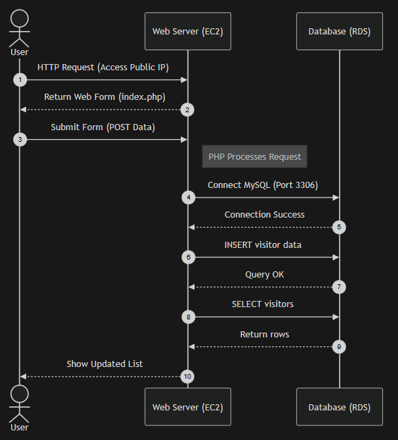
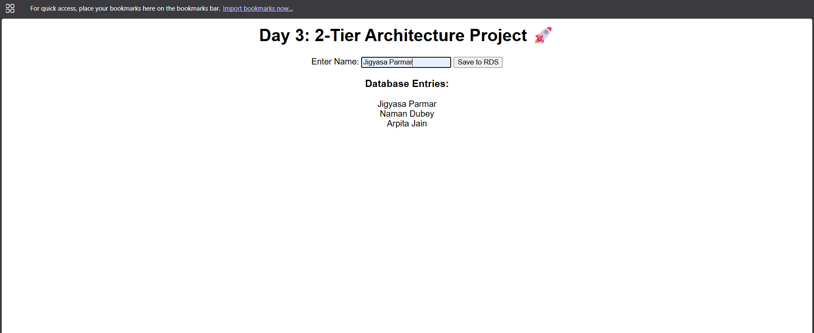
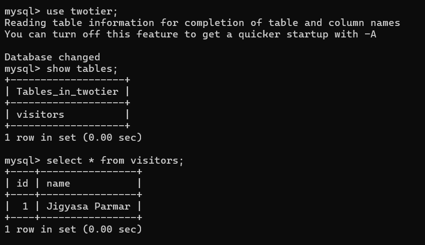

# AWS-2Tier-Architecture-Project
Deploying a 2-Tier Web Application using AWS EC2 and RDS.
This project demonstrates the implementation of a professional 2-Tier Architecture on AWS. By separating the application and database layers, we ensure better security, scalability, and managed data persistence.

### 🏗️ Architecture Design
The setup follows a classic distributed system design:

**Application Tier:**  An Amazon EC2 instance (Ubuntu 24.04) running an Apache Web Server. It handles user requests and executes the PHP application logic.

**Database Tier:** A managed Amazon RDS (MySQL) instance. It provides a secure, private environment for data storage that is not directly accessible from the internet.

**Security Layer:** Implemented Security Group Referencing to allow traffic on Port 3306 only from the Web Server's Security Group, ensuring a "Least Privilege" access model.

### How's the Application Work?


***

### 🛠️ Tech Stack
**Cloud:** AWS (EC2, RDS)
**Web Server:** Apache2
**Language:** PHP
**Database:** MySQL
**Operating System:** Ubuntu 24.04 LTS

***

### Implementation Steps
***Phase 1: Database Tier Setup (Amazon RDS) ***
We start with the database layer to ensure the backend is ready before the application launch.

RDS Console: Navigate to Create database.

Engine: Select MySQL with Free Tier template.

Config: Instance ID: twotier-database | User: admin | Password: <YOUR-PASSWORD>.

Connectivity: Set Public Access to 'No' and create a new Security Group (rds-sg).

Endpoint: Once 'Available', copy the RDS Endpoint for application connection.

***Phase 2: Application Tier Setup (Amazon EC2)***
Launching the compute resource to host our web server.

Launch Instance: Name: Twotier_WebServer | OS: Ubuntu 24.04.

Security Group: Created web-sg allowing SSH (Port 22) and HTTP (Port 80).

***Phase 3: Networking***
Linking the two tiers securely.

RDS Inbound Rules: Edit rds-sg to allow MySQL/Aurora (Port 3306).

Source: Restricted access by selecting the web-sg ID as the source.

***Phase 4: Server Configuration & Deployment***
Installing the Apache server,php,libapache2-mod-php, mysql-client and deploying the PHP application.

Install Stack: Run the following commands via SSH:

Bash
sudo apt update -y
sudo apt install apache2 php libapache2-mod-php php-mysql mysql-client -y
Application Code: Created index.php in /var/www/html/ with the RDS connection logic.

***Paste this code into index.php code, replace the placeholders with your RDS-Endpoint,DB-Password, DB-Name***
```
<?php
$host = "PASTE_YOUR_RDS_ENDPOINT_HERE";
$user = "admin";
$pass = "<YOUR-DB-PASSWORD>";
$db   = "<DB_NAME>";

$conn = new mysqli($host, $user, $pass, $db);

if ($conn->connect_error) {
    die("Connection failed: " . $conn->connect_error);
}

// Create Table if not exists
$conn->query("CREATE TABLE IF NOT EXISTS visitors (id INT AUTO_INCREMENT PRIMARY KEY, name VARCHAR(100))");

if(isset($_POST['submit'])){
    $name = $_POST['name'];
    $conn->query("INSERT INTO visitors (name) VALUES ('$name')");
}
?>

<html>
<body style="text-align:center; font-family: Arial;">
    <h1>Day 3: 2-Tier Architecture Project 🚀</h1>
    <form method="post">
        Enter Name: <input type="text" name="name">
        <input type="submit" name="submit" value="Save to RDS">
    </form>
    <h3>Database Entries:</h3>
    <?php
    $res = $conn->query("SELECT name FROM visitors");
    while($row = $res->fetch_assoc()) { echo $row['name'] . "<br>"; }
    ?>
</body>
</html>
```
* NOTE: If Application is not deployed, then delete the index.html file inside the /var/www/html/

Database Init: Connected to RDS via terminal to create the database:

```SQL
CREATE DATABASE twotier;
```
***

### 🚀 How to Run
Clone this repository.

Update the $host and $pass variables in index.php with your RDS credentials.

Upload the file to your EC2 instance.

Access the application via http://<EC2-Public-IP>.

***

### Final Validation
***Browser Verification***
Public Access: Copied the IPv4 Public IP address of the EC2 instance from the AWS Management Console.

Web Testing: Pasted the IP address into a web browser to access the hosted application.

Data Entry: Once the form loaded successfully, entered test data (e.g., Name) into the input field to initiate a backend request.



*** Database Validation ***
Data Persistence: Submitted the form and verified that the data was successfully transmitted to the RDS MySQL instance.

Successful Connectivity: Confirmed that the "Database Entries" were reflected on the screen in real-time, proving a secure and functional connection between the Application Tier (EC2) and the Data Tier (RDS).

***Backend Verification (SQL)***
To ensure the entries are stored successfully in the RDS instance, I ran the following commands via the EC2 terminal:

```SQL
/* Connect to RDS first */
mysql -h <your-rds-endpoint> -u admin -p

/* Verify Data */
USE twotier;
SHOW TABLES;
SELECT * FROM visitors;
```
***Result:*** This confirmed that the web form data was correctly written to the RDS table.

